# Attendance Analyzer

Attendance Analyzer is a Python-based desktop application designed to help educators and instructors take attendance for different classes. This application uses the tkinter library for the graphical user interface and Firebase Realtime Database for cloud storage of attendance records.

## Table of Contents
- [Prerequisites](#prerequisites)
- [Installation](#installation)
- [Usage](#usage)
- [Contributors](#contributors)
- [License](#license)
- [Contact Information](#contact-information)

## Prerequisites
Before you can use Attendance Analyzer, make sure you have the following prerequisites installed on your system:

- Python 3.x
- tkinter library
- firebase_admin library (for Firebase integration)

## Screenshots
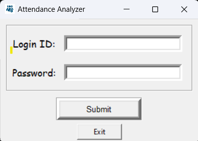
<br>
<br>
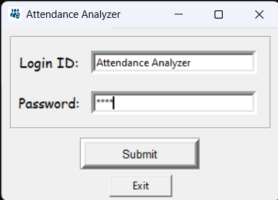
<br>
<br>
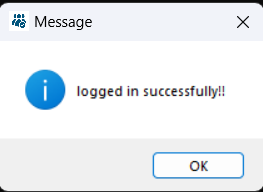
<br>
<br>
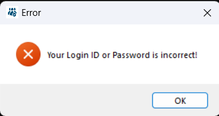
<br>
<br>
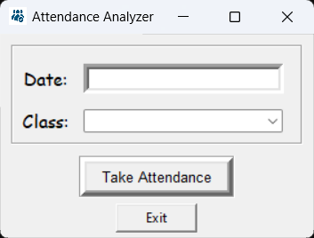
<br>
<br>
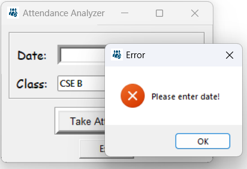
<br>
<br>
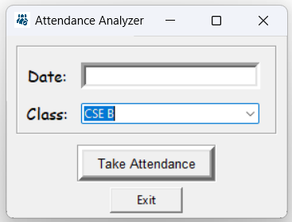
<br>
<br>
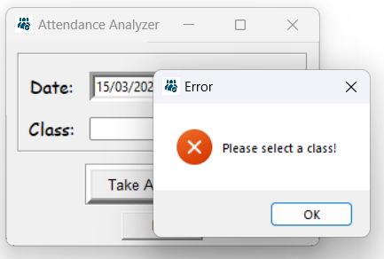
<br>
<br>
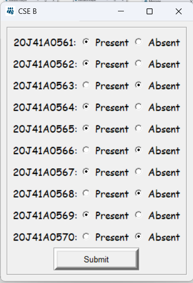
<br>
<br>
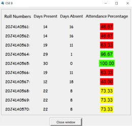
<br>
<br>
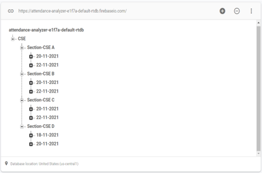
<br>
<br>
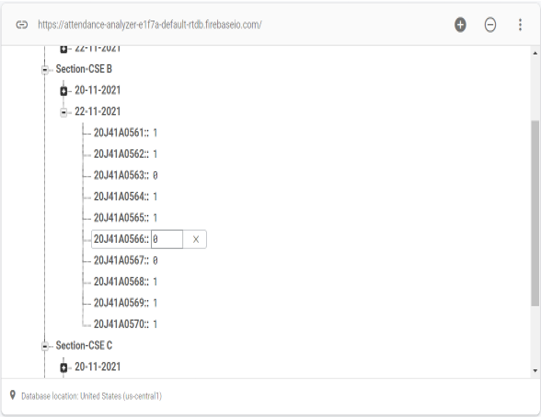
<br>
<br>

## Installation
1. Clone this repository to your local machine:

   ```shell
   git clone https://github.com/yourusername/attendance-analyzer.git

2. Navigate to the project directory:

    ```shell
    cd attendance-analyzer

3. Install the required Python libraries if you haven't already:

    ```shell
    pip install firebase-admin

4. Run the application:

    ```shell
    python main.py

## Usage
1. Launch the application by running main.py.
2. Enter your login ID and password to log in. (e.g., Login ID: Attendance Analyzer, Password: MREC)
3. Provide the date and select the class for which you want to take attendance (CSE A, CSE B, CSE C, or CSE D).
4. Click the "Take Attendance" button to begin taking attendance for the selected class and date.
5. A new window will open, displaying a list of students for the selected class. Use the radio buttons to mark students as "Present" or "Absent."
6. Click the "Submit" button to save the attendance data to both a local file and the Firebase Realtime Database.
7. The application will display attendance statistics, including the number of days present, days absent, and the attendance percentage for each student.

## Contributors
• [Arshad Mahemood Patel](https://github.com/arshadpatel)<br>
 • [Aman Kumar Singh](https://github.com/BlankCodes)<br>
 • [Dev Trivedi](https://github.com/d3v07)<br>
 • [Vamsi Krishna](https://github.com/VamsiKr1shna)<br>
 • [Raj Kishor Sahu](https://github.com/raj-119)

## License
This project does not have an open-source license. You are welcome to view the code for educational purposes, but you do not have permission to use, modify, distribute, or contribute to this project without explicit written consent from the project owner.

## Contact Information
If you have any questions or suggestions regarding this project, please feel free to contact the project owner:

-Name: [Arshad Mahemood Patel](https://github.com/arshadpatel)


